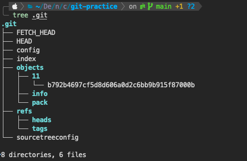
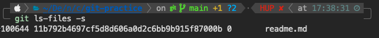
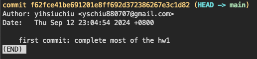
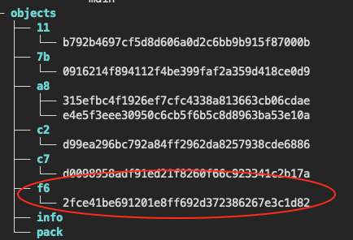

## 說明 blob, tree, commit, branch, head 分別是什麼
1. blob  
blob在git裡的代表一個檔案，通常是一組40碼的hex，每個檔案會透過hash(SHA-1)產生一組blob值，已commit的檔案可以用`ls-tree`查看，如果是暫存區的檔案則用`ls-files`。  
只要對檔案有改動，blob就會變動(hash特性)，git可以查看哪些檔案有改動應該也是基於blob的應用。
2. tree  
tree是git的目錄，就像電腦的資料夾一樣，tree可以包含很多檔案(blob)跟資料夾(tree)
3. commit  
commit會根據git專案改動的內容(比對blob、tree等)，將有改動之內容壓縮上傳。為了有效追蹤改動內容，commit也會有hash值，並紀錄前一個commit的hash值。另外還有author的name、commit msg等等內容，方邊協作時辨識。
4. branch  
branch可以讓git版本分支，讓專案像樹狀一樣分頭開發，branch出去commit就會在branch上；如果要合併回主幹，要使用merge。
5. head  
head即為目前所在commit的標籤，也就是目前資料夾內資料的版本(commit)。

## 紀錄在 git repo 操作過程中，.git 檔案夾裡的變化，看看你可以觀察到什麼
1. blob會存在objects資料夾裡  
當我add readme.md後，可以看到objects資料夾裡多了一筆一串數字的內容，透過`ls-files`可以看出內容相符。

2. commit也會存在objects資料夾裡  

3. push到github上後，在ref資料夾中除了main以外，還會有一個origin/main，一個是指到本地資料夾，一個是指到github資料夾，如果開branch，也會產生相應名稱的資料

## commit message 應該怎麼寫比較好？應該有什麼 style 嗎？
應該要有這個commit的主要貢獻類型，例如feat、fix、refactor、test等等。後面應該要接貢獻敘述，並於最後可以標註一些對應內容，例如解決某個issue(e.g. close #123)。

## 額外研究紀錄
### 如何存資料
git採用的是**快照而非差異**，部分版本控制系統會用差異方式處理版本，然而git是採用上面所述hash值方式進行快照比對，只儲存改動檔案，未改動部分則直接指向前一個檔案。  
快照的好處在於快，當要存取某個版本時不需要每次都從最底下開始堆一個個差異上來，尤其是當處理合併的時候，應該更能看出快照跟差異的差別。當然快照的缺點就是儲存空間相比差異會比較大，另外如果在變動非常小且頻繁的情境下，效能可能也不會比差異來的好。

### git如何管理各個版本
就如前面說的，git會在每次檔案更新時，會透過SHA-1產生hash來看檔案是否有更動，而這筆hash值就會成為檔案的索引，而真正的檔案會透過 zlib壓縮(基於DEFLATE演算法，zip跟png好像都是這樣的壓縮法)存在.git/objects中。  
在commit的時候，會儲存根目錄的tree的hash值，透過tree就可以遍歷整個tree各個blob，若有hash不同(即檔案有更動)，就從.git/objects取得目標版本的實際資料。

### merge vs rebase
merge跟rebase目的都是要合併分支，然而手法上卻不一樣，merge會保留分支的完整歷史，rebase則是把分支的內容在要合併的分支上直接重現，因此分支的歷史會不見。根據GPT的說法，一般規則是：不要對公開的分支進行 rebase，而只在本地的開發分支上使用它。