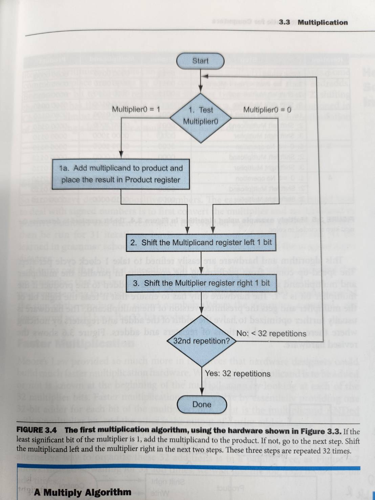
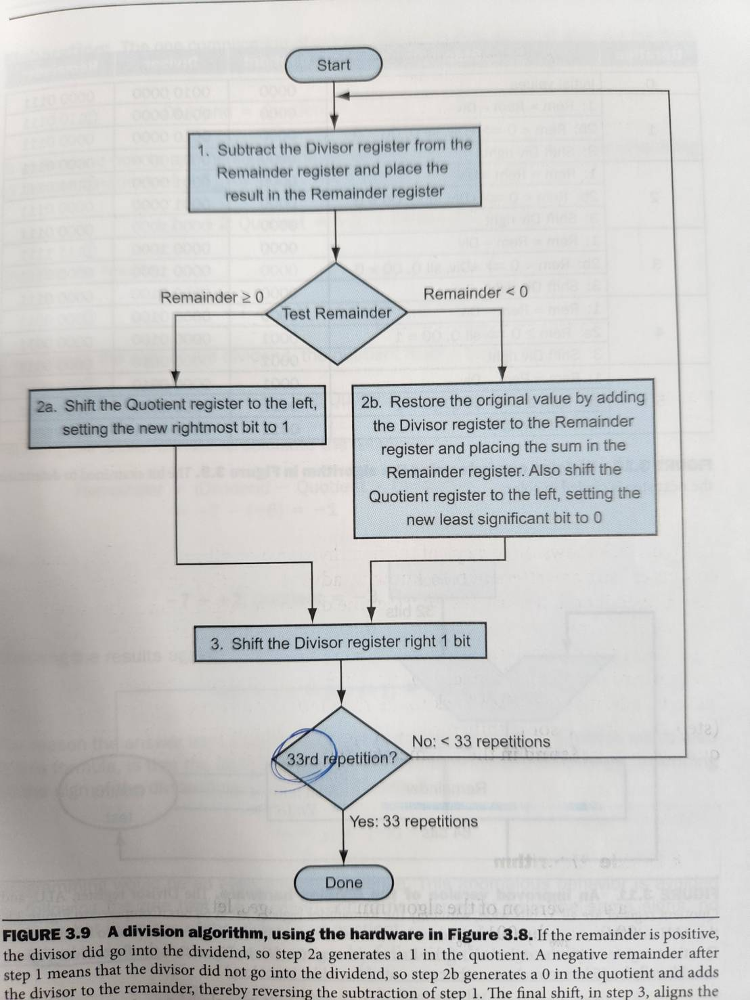

# 安裝版本
node v18.20.4 (npm v10.7.0)

# NVM(Node Version Manager)
NVM是node的版本管理系統，在不同專案中，常常會有特定版本的需求。例如至少要多少版本以上，有時候也會有些套件在版本以上就不支援了，因此使用NVM進行node版本切換非常重要。

幾個常見的nvm指令如下:
1. `nvm ls`  
列出本地端目前有安裝的node版本
2. `nvm install <version>`
安裝特定版本的node，例如`nvm install 18`就會安裝18版的node
3. `nvm use <version>`
切換到特定版本的node，例如`nvm use 18`就會切換到18版的node

# NPM(Node Package Manager)
NPM是node的套件管理系統，絕大部分的node open source都會上傳到npm上，透過npm可以簡單的把要用的套件下載下來(通常會放在當前資料夾附近的node_module資料夾裡)，另外npm也會將下載下來的套件資訊(名稱、版本)維護到package.json裡(dependencies)。

幾個常見的npm指令如下:
1. `npm init`  
初始化npm，輸入完一些資訊後會產生package.json檔，讓其他人更容易了解這個專案(如入口程式...)
2. `npm install`  
根據package.json安裝相關依賴套件
3. `npm install <package_name>`  
下載該套件，後面可以加`@<version>`來指定套件版本，也可以使用`-g`標籤來設定全域安裝。

# [補充] 測試程式 討論
在計算機組織與結構中提到，乘法、除法器是由加法、減法器來實現。以最簡單易懂的架構來說，可以用我們學的直式乘法、除法來實現，在不增加硬體資源的情況下(就只有一個ALU)，其他架構應該也只能減少運算所佔用的cache or memory(空間改善而非時間)。  
乘法器除法器的具體流程圖如下：

(ref: 計組算盤本)  

可以看出乘法、除法依***數字範圍大小***會有不同的硬體運算需求，大略上來看(不看shift的部分)跟直接用加法硬算是**log關係**，例如3*15用加法硬算要加15次，而根據乘法器的流程來看repetition等於4(15 = 1111b)，這還是剛好有數字範圍大小=4bits的狀況，若是用int的話，repetition就會是32。

總結來說我覺得如老師上課所說，在數字不大的情況下用公式解應該真的不會快多少，但當然還有很多點是需要考量的，如語言本身(編譯器優化)、電腦硬體資源(現在的電腦當然不會只有一個ALU)。要用理論的方式完整分析兩個方法的performance我想應該很難，還是用實驗的方式就好了。
