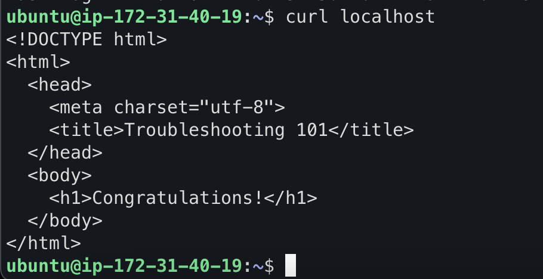

# 初次 debug
## sudo nginx -t 確認 nginx 設定
發現以下問題:  
[emerg] 1279#1279: unexpected ";" in /etc/nginx/nginx.conf:8  
進去檔案內把多的 ; 刪掉  
重啟nginx

## sudo lsof -i :80 確認 port 狀態
發現到是 srv 服務佔用 80 port  
使用 kill {srv的pid} 把服務關掉並重啟 nginx

## sudo iptables -L 確認防火牆狀態
發現有規則把 tcp REJECT 掉  
使用 sudo iptables -D INPUT 1 把規則刪掉

## sudo chmod 660 /var/myweb/index.html 設定檔案權限
發現 curl localhost 回傳 403  
查看 /var/log/myweb/error.log 發現錯誤訊息有 permission denied  
執行 sudo chmod 660 /var/myweb/index.html 重新設定權限

## 執行成功！

# 後續修改
## 設定 systemd 開啟啟用服務
sudo systemctl disable srv  
sudo systemctl enable nginx

## 修改防火牆規則
sudo vim /etc/iptables/rules.v4  
把reject那條刪掉

## 刪除log檔案
sudo find / -type f -size +500M  
找到log檔(在/var/log/system) 透過 rm 刪除